# Проектирование системы (UML диаграммы)
## Содержание
1. [Диаграмма использования](#par1)    
1.1. [Описание актеров](#par1.1)    
1.2. [Варианты использования (сценарии)](#par1.2)    
&nbsp;&nbsp;&nbsp;&nbsp; 1.2.1. [Просмотреть продукты в холодильнике](#par1.2.1)  
&nbsp;&nbsp;&nbsp;&nbsp; 1.2.2. [Удалить продукт из холодильника](#par1.2.2)  
&nbsp;&nbsp;&nbsp;&nbsp; 1.2.3. [Редактировать продукт в холодильнике](#par1.2.3)  
&nbsp;&nbsp;&nbsp;&nbsp; 1.2.4. [Добавить продукт в холодильник](#par1.2.4)  
&nbsp;&nbsp;&nbsp;&nbsp; 1.2.5. [Просмотреть продукты на полке](#par1.2.5)   
&nbsp;&nbsp;&nbsp;&nbsp; 1.2.6. [Удалить продукт с полки](#par1.2.6)  
&nbsp;&nbsp;&nbsp;&nbsp; 1.2.7. [Редактировать продукт на полке](#par1.2.7)  
&nbsp;&nbsp;&nbsp;&nbsp; 1.2.8. [Добавить продукт на полку](#par1.2.8)  
&nbsp;&nbsp;&nbsp;&nbsp; 1.2.9. [Просмотреть список покупок](#par1.2.9)   
&nbsp;&nbsp;&nbsp;&nbsp; 1.2.10. [Удалить продукт из списка покупок](#par1.2.10)  
&nbsp;&nbsp;&nbsp;&nbsp; 1.2.11. [Купить продукт из списка покупок](#par1.2.11)  
&nbsp;&nbsp;&nbsp;&nbsp; 1.2.12. [Добавить продукт в список покупок](#par1.2.12)  
&nbsp;&nbsp;&nbsp;&nbsp; 1.2.13. [Изменить параметры уведомлений](#par1.2.13)    
&nbsp;&nbsp;&nbsp;&nbsp; 1.2.14. [Получить уведомление](#par1.2.14)     
2. [Диаграммы деятельности](#par2)   
2.1. [Удаление продукта из холодильника](#par2.1)  
2.2. [Редактирование продукта в холодильнике](#par2.2)  
2.3. [Добавление продукта в холодильник](#par2.3)  
2.4. [Покупка продукта из списка покупок](#par2.4)  
2.5. [Изменение параметров уведомлений](#par2.5) 
3. [Диаграммы последовательности](#par3)    
3.1. [Удаление продукта из холодильника](#par3.1)  
3.2. [Редактирование продукта в холодильнике](#par3.2)  
3.3. [Добавление продукта в холодильник](#par3.3)  
3.4. [Покупка продукта из списка покупок](#par3.4)  
3.5. [Изменение параметров уведомлений](#par3.5)  
4. [Диаграмма состояний](#par4)  
5. [Диаграмма классов](#par5)  
6. [Структурная диаграмма](#par6)   

## <a name="par1">1. Диаграмма использования</a>
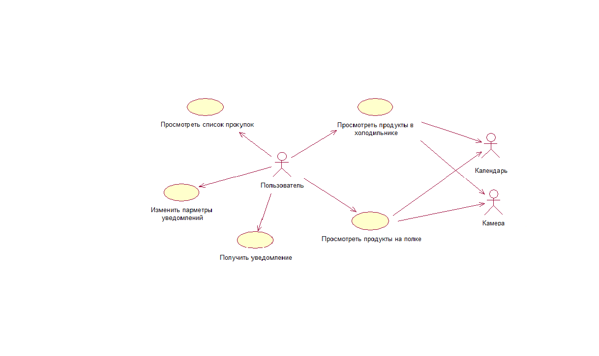
### <a name="par1.1">1.1. Описание актеров</a>

Описание актеров соответствует [описанию аудитории приложения в требованиях к проекту](SRS.md#par2.3.1):

Так как приложение не подразумевает регистрацию пользователей, поэтому разбиения на классы пользователей нет. Все пользователи равны в своих правах и возможностях, каждый из них привязан только к продуктам в своем холодильнике.

### <a name="par1.2">1.2. Варианты использования (сценарии)</a>  

#### <a name="par1.2.1">1.2.1. Просмотреть продукты в холодильнике</a>

**Описание.** Вариант использования "Просмотреть продукты в холодильнике" позволяет просмотреть список продуктов, которые находятся в холодильнике, указывая их срок годности.

**Предусловия.** Выбор окна просмотра продуктов в холодильнике.

**Основной поток.**
1. Вариант использования начинается, когда пользователь выбирает окно просмотра продуктов в холодильнике.
2. Система выводит продукты, которые находятся в холодильнике, указывая характеристики каждого продукта: название, фото, срок годности, количество.
3. Вариант использования завершается.

#### <a name="par1.2.2">1.2.2. Удалить продукт из холодильника</a>

**Описание.** Вариант использования "Удалить продукт из холодильника" позволяет удалить выбранные пользователем продукты из холодильника.

**Предусловия.** Выбор окна просмотра продуктов в холодильнике. Выбор продукта долгим нажатием на него.

**Основной поток.**
1. Вариант использования начинается, когда пользователь выбирает продукт долгим нажатием на него.
2. Система выделяет выбранный продукт.
3. Система предлагает пользователю выбрать другие продукты коротким нажатием на них.
4. Пользователь выбирает продукты, которые необходимо удалить.
5. Пользователь нажимает кнопку "Удалить".
6. Система удаляет выбранные продукты из холодильника.
7. Система открывает окно просмотра продуктов в холодильнике.
8. Вариант использования завершается.

**Постусловия.** Продукт удален из холодильника.

#### <a name="par1.2.3">1.2.3. Редактировать продукт в холодильнике</a>

**Описание.** Вариант использования "Редактировать продукт в холодильнике" позволяет изменить текущее количество продукта в холодильнике. 

**Предусловия.** Выбор окна просмотра продуктов в холодильнике. Выбор продукта коротким нажатием на него.

**Основной поток.**
1. Вариант использования начинается, когда пользователь выбирает продукт коротким нажатием на него.
2. Система открывает окно просмотра продукта.
3. Система предлагает пользователю изменить текущее количество продукта. 
4. Пользователь нажимает кнопку "Ок".
5. Если количество продукта равно нулю, то система удаляет продукт из холодильника. 
6. Система открывает окно просмотра продуктов в холодильнике.
7. Вариант использования завершается.

**Постусловия.** Изменено количество выбранного продукта.

#### <a name="par1.2.4">1.2.4. Добавить продукт в холодильник</a>

**Описание.** Вариант использования "Добавить продукт в холодильник" позволяет добавить продукт в холодильник, при этом указывая дополнительные характеристики продукта: срок годности, количество, фото.

**Предусловия.** Выбор окна просмотра продуктов в холодильнике. Нажатие кнопки "Добавить" в окне просмотра продуктов в холодильнике.

**Основной поток.**
1. Вариант использования начинается, когда пользователь нажимает кнопку "Добавить" в окне просмотра продуктов в холодильнике.
2. Система открывает окно добавления продукта в холодильник.
3. Система предлагает пользователю ввести название продукта, выбрать срок годности, используя календарь, добавить фото, используя камеру, а также указать количество товара.
4. Пользователь вводит необходимые данные.
5. Пользователь нажимает кнопку "Добавить в холодильник".
6. Если пользователь ввел некорректные данные, то поток вернется на пункт 3.
7. Система добавляет продукт в холодильник.
8. Система открывает окно просмотра продуктов в холодильнике.
9. Вариант использования завершается.

**Постусловия.** Продукт добавлен в холодильник.

#### <a name="par1.2.5">1.2.5. Просмотреть продукты на полке</a>

**Описание.** Вариант использования "Просмотреть продукты на полке" позволяет просмотреть список продуктов, которые находятся на полке, указывая их срок годности.

**Предусловия.** Выбор окна просмотра продуктов на полке.

**Основной поток.**
1. Вариант использования начинается, когда пользователь выбирает окно просмотра продуктов на полке.
2. Система выводит продукты, которые находятся на полке, указывая характеристики каждого продукта: название, фото, срок годности, количество.
3. Вариант использования завершается.

#### <a name="par1.2.6">1.2.6. Удалить продукт с полки</a>

**Описание.** Вариант использования "Удалить продукт с полки" позволяет удалить выбранные пользователем продукты с полки.

**Предусловия.** Выбор окна просмотра продуктов на полке. Выбор продукта долгим нажатием на него.

**Основной поток.**
1. Вариант использования начинается, когда пользователь выбирает продукт долгим нажатием на него.
2. Система выделяет выбранный продукт.
3. Система предлагает пользователю выбрать другие продукты коротким нажатием на них.
4. Пользователь выбирает продукты, которые необходимо удалить.
5. Пользователь нажимает кнопку "Удалить".
6. Система удаляет выбранные продукты с полки.
7. Система открывает окно просмотра продуктов на полке.
8. Вариант использования завершается.

**Постусловия.** Продукт удален с полки.

#### <a name="par1.2.7">1.2.7. Редактировать продукт на полке</a>

**Описание.** Вариант использования "Редактировать продукт на полке" позволяет изменить текущее количество продукта на полке. 

**Предусловия.** Выбор окна просмотра продуктов на полке. Выбор продукта коротким нажатием на него.

**Основной поток.**
1. Вариант использования начинается, когда пользователь выбирает продукт коротким нажатием на него.
2. Система открывает окно просмотра продукта.
3. Система предлагает пользователю изменить текущее количество продукта. 
4. Пользователь нажимает кнопку "Ок".
5. Если количество продукта равно нулю, то система удаляет продукт с полки.
6. Система открывает окно просмотра продуктов на полке.
7. Вариант использования завершается.

**Постусловия.** Изменено количество выбранного продукта.

#### <a name="par1.2.8">1.2.8. Добавить продукт на полку</a>

**Описание.** Вариант использования "Добавить продукт на полку" позволяет добавить продукт на полку, при этом указывая дополнительные характеристики продукта: срок годности, количество, фото.

**Предусловия.** Выбор окна просмотра продуктов на полке. Нажатие кнопки "Добавить" в окне просмотра продуктов на полке.

**Основной поток.**
1. Вариант использования начинается, когда пользователь нажимает кнопку "Добавить" в окне просмотра продуктов на полке.
2. Система открывает окно добавления продукта на полку.
3. Система предлагает пользователю ввести название продукта, выбрать срок годности, используя календарь, добавить фото, используя камеру, а также указать количество товара.
4. Пользователь вводит необходимые данные.
5. Пользователь нажимает кнопку "Добавить на полку".
6. Если пользователь ввел некорректные данные, то поток вернется на пункт 3.
7. Система добавляет продукт на полку.
5. Система открывает окно просмотра продуктов на полке.
6. Вариант использования завершается.

**Постусловия.** Продукт добавлен на полку.

#### <a name="par1.2.9">1.2.9. Просмотреть список покупок</a>

**Описание.** Вариант использования "Просмотреть список покупок" позволяет просмотреть список продуктов, которые необходимо купить.

**Предусловия.** Выбор окна просмотра списка покупок.

**Основной поток.**
1. Вариант использования начинается, когда пользователь выбирает окно просмотра списка покупок.
2. Система выводит список покупок, указывая информацию о каждом продукте: название, место добавления, комментрий.
3. Вариант использования завершается.

#### <a name="par1.2.10">1.2.10. Удалить продукт из списка покупок</a>

**Описание.** Вариант использования "Удалить продукт из списка покупок" позволяет удалить выбранные пользователем продукты из списка покупок.

**Предусловия.** Выбор окна просмотра списка покупок. Выбор продукта долгим нажатием на него.

**Основной поток.**
1. Вариант использования начинается, когда пользователь выбирает продукт из списка покупок долгим нажатием на него в списке покупок.
2. Система выделяет выбранный продукт.
3. Система предлагает пользователю выбрать другие продукты коротким нажатием на них.
4. Пользователь выбирает продукты, которые необходимо удалить.
5. Пользователь нажимает кнопку "Удалить".
6. Система удаляет выбранные продукты из списка покупок.
7. Система открывает окно просмотра списка покупок.
8. Вариант использования завершается.

**Постусловия.** Продукт удален из списка покупок.

#### <a name="par1.2.11">1.2.11. Купить продукт из списка покупок</a>

**Описание.** Вариант использования "Купить продукт из списка покупок" позволяет удалить продукт из списка покупок и добавить его в холодильник либо на полку, при этом указывая дополнительные характеристики продукта: срок годности, количество, фото.

**Предусловия.** Выбор окна просмотра списка покупок. Выбор продукта из списка покупок долгим нажатием на него в списке покупок. 

**Основной поток.**
1. Вариант использования начинается, когда пользователь выбирает продукт из списка покупок долгим нажатием на него в списке покупок.
2. Система выделяет выбранный продукт.
3. Система предлагает пользователю выбрать другие продукты коротким нажатием на них.
4. Пользователь выбирает продукты, которые были куплены.
5. Пользователь нажимает кнопку "Купить".
6. Система удаляет выбранные продукты из списка покупок.
7. Система поочередно добавляет продукты в холодильник или полку в зависимости от выбранного места добавления в окне добавления продукта в список покупок, запрашивая дополнительные характеристики продукта: срок годности, количество, фото.
8. Система открывает окно просмотра списка покупок.
9. Вариант использования завершается.

**Постусловия.** Продукт добавлен в холодильник или на полку. 

#### <a name="par1.2.12">1.2.12. Добавить продукт в список покупок</a>

**Описание.** Вариант использованя "Добавить продукт в список продуктов" позволяет добавить продукт в список покупок.  

**Предусловия.** Выбор окна просмотра списка покупок. Нажатие кнопки "Добавить" в окне просмотра списка покупок. 

**Основной поток:**  
1. Вариант использования начинается, когда пользователь нажимает на кнопку "Добавить" в окне просмотра списка покупок.
2. Система предлагает пользователю ввести название продукта и комментрий к нему, если нужно, а также выбрать куда будет добавлен продукт после покупки (холодильник, полка).
3. Пользователь вводит название продукта и комментарий, если нужно.
4. Пользователь нажимает кнопку "Добавить в список покупок".
5. Система добавляет продукт в список продуктов.
6. Система открывает окно просмотра списка покупок.
7. Вариант использования завершается

**Постусловия.** Продукт с введенным пользователем названием и комментарием добавлен в список покупок.

#### <a name="par1.2.13">1.2.13. Изменить параметры уведомлений</a>

**Описание.** Вариант использования "Изменить параметры уведомлений" позволяет изменить параметры уведомлений о продуктах, срок годности которых подходит к концу.

**Предусловия.** Выбор окна изменения параметров уведомлений.

**Основной поток.**
1. Вариант использования начинается, когда пользователь открывает окно изменения параметров уведомлений.
2. Система предлагает пользователю изменить параметры уведомлений: разрешить / не разрешить отправлять уведомления, как часто уведомлять, в какое время суток уведомлять.
3. Пользователь устанавливает параметры уведомлений.
4. Пользователь нажимает кнопку "Ок".
5. Система устанавливает введенные параметры уведомлений.
6. Система открывает информационное окно.
7. Вариант использования завершается

**Постусловия.** Изменены параметры уведомлений.

#### <a name="par1.2.14">1.2.14. Получить уведомление</a>

**Описание.** Вариант использования "Получить уведомление" позволяет получать уведомления о продуктах, срок годности которых подходит к концу.

**Предусловия.** Выбор информационного окна. Выбор окна изменения параметров уведомлений. Разрешить системе присылать уведомления о продуктах, срок годности которых подходит к концу.

**Основной поток.**
1. Вариант использования начинается, когда пользователь разрешает системе присылать уведомления в окне изменения параметров уведомлений.
2. Система просматривает продукты в холодильнике и на полке, находя продукты, срок годности которых подходит к концу.
3. Система формирует список продуктов, срок годности которых подходит к концу.
4. Система уведомляет пользователя о продуктах, срок годности которых подходит к концу, в соответствии с параметрами, установленными в окне изменения параметров уведомлений.
6. Вариант использования завершается

**Постусловия.** Пользователь получил уведомление, в котором указывается продукт, срок годности которого подходит к концу.

## <a name="par2">2. Диаграммы деятельности</a>

### <a name="par2.1">2.1. Удаление продукта из холодильника</a>
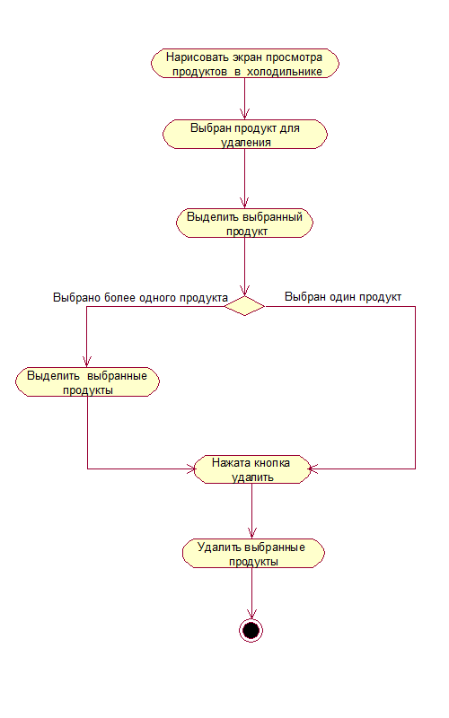

**Описание.** Описание соответствует описанию варианта использования "[Удалить продукт из холодильника](#par1.2.2)".

### <a name="par2.2">2.2. Редактирование продукта в холодильнике</a>
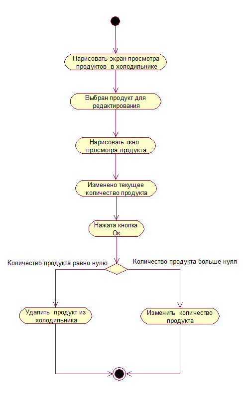

**Описание.** Описание соответствует описанию варианта использования "[Редактировать продукт в холодильнике](#par1.2.3)".

### <a name="par2.3">2.3. Добавление продукта в холодильник</a>
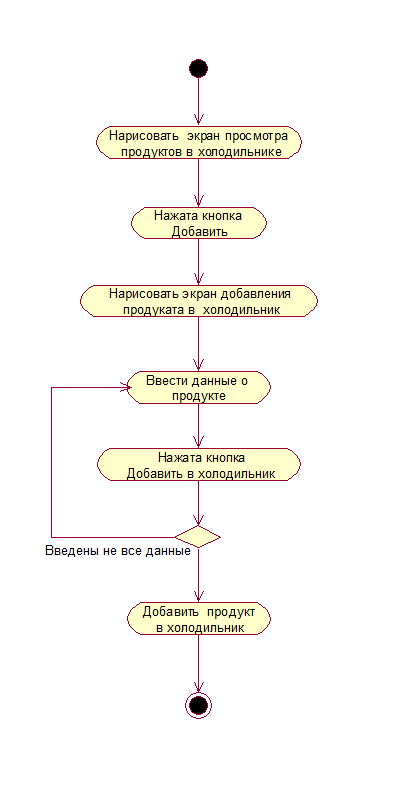

**Описание.** Описание соответствует описанию варианта использования "[Добавить продукт в холодильник](#par1.2.4)".

### <a name="par2.4">2.4. Покупка продукта из списка покупок</a>
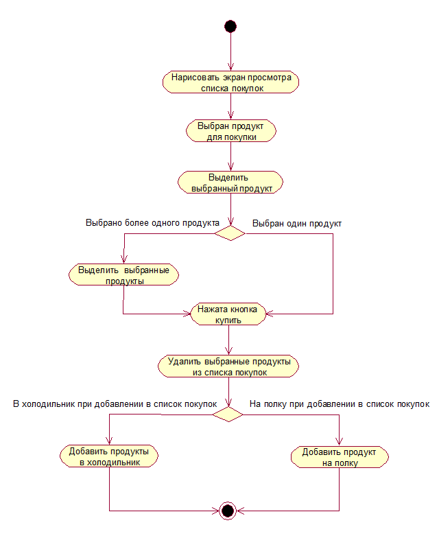

**Описание.** Описание соответствует описанию варианта использования "[Купить продукт из списка покупок](#par1.2.11)".

### <a name="par2.5">2.5. Изменение параметров уведомлений</a>
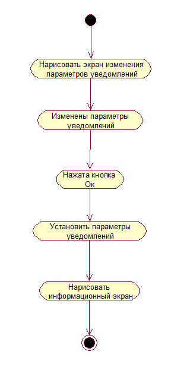

**Описание.** Описание соответствует описанию варианта использования "[Изменить параметры уведомлений](#par1.2.13)".

## <a name="par3">3. Диаграммы последовательности</a>

### <a name="par3.1">3.1. Удаление продукта из холодильника</a>
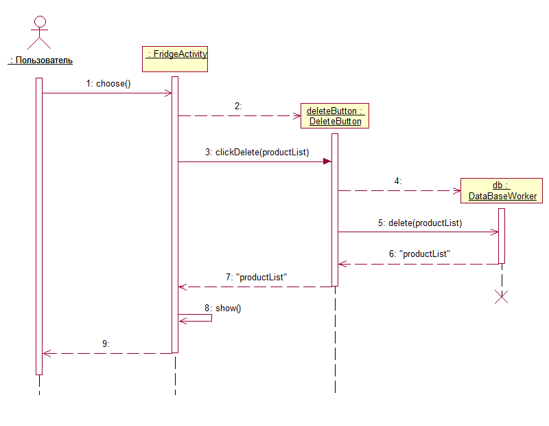

**Описание.** Диаграмма последовательности представлена для диаграммы деятельности "[Удаление продукта из холодильника](#par2.1)".

### <a name="par3.2">3.2. Редактирование продукта в холодильнике</a>
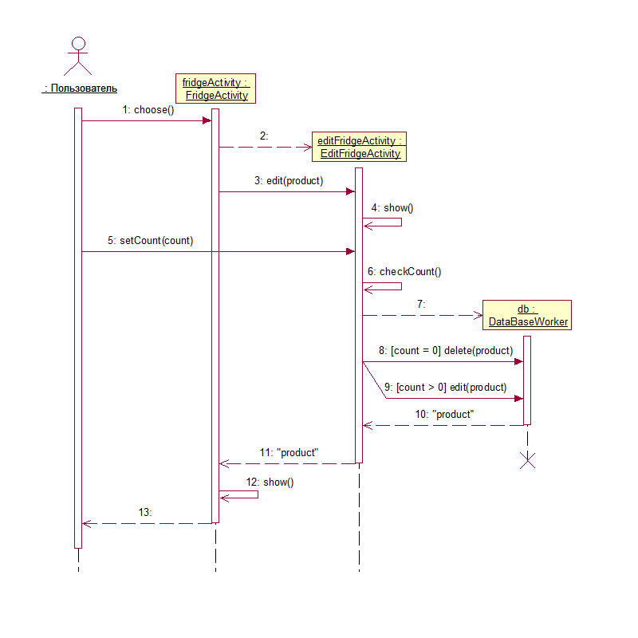

**Описание.** Диаграмма последовательности представлена для диаграммы деятельности "[Редактирование продукта в холодильнике](#par2.2)".  

### <a name="par3.3">3.3. Добавление продукта в холодильник</a>
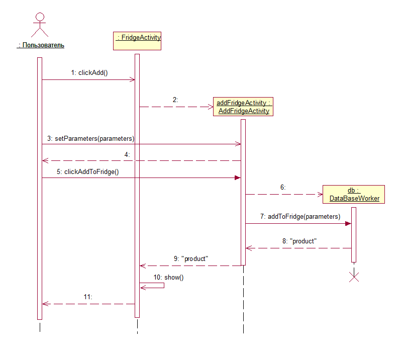

**Описание.** Диаграмма последовательности представлена для диаграммы деятельности "[Добавление продукта в холодильник](#par2.3)".

### <a name="par3.4">3.4. Покупка продукта из списка покупок</a>
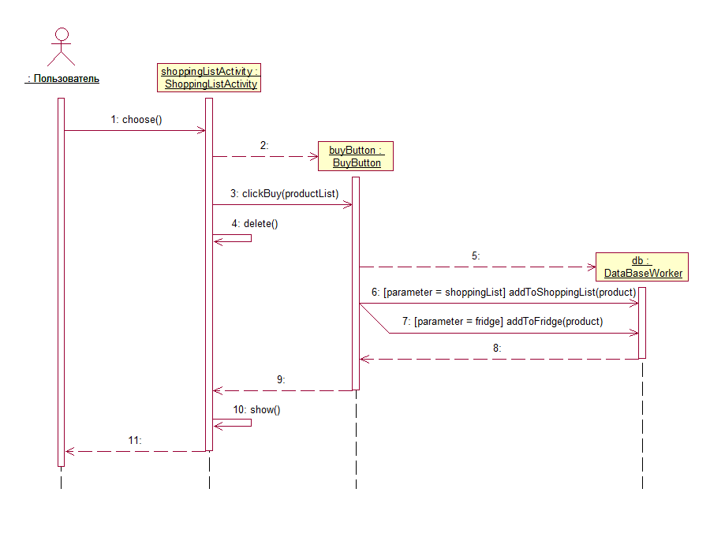

**Описание.** Диаграмма последовательности представлена для диаграммы деятельности "[Покупка продукта из списка покупок](#par2.4)".

### <a name="par3.5">3.5. Изменение параметров уведомлений</a>
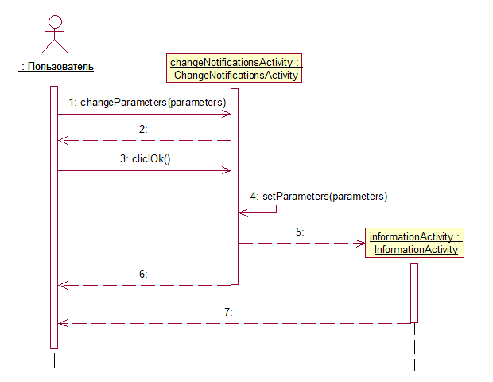

**Описание.** Диаграмма последовательности представлена для диаграммы деятельности "[Изменение параметров уведомлений](#par2.5)".  

## <a name="par4">4. Диаграмма состояний</a>
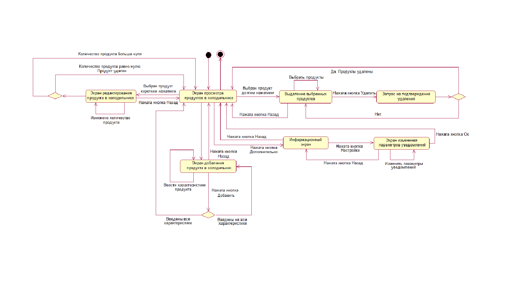 

## <a name="par5">5. Диаграмма классов</a>
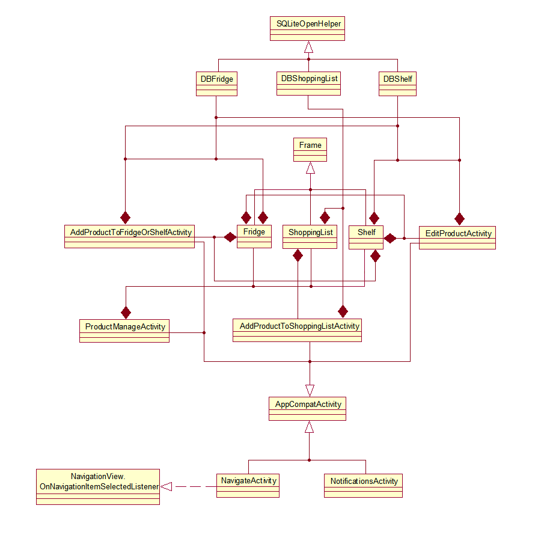  

## <a name="par6">6. Структурная диаграмма</a>
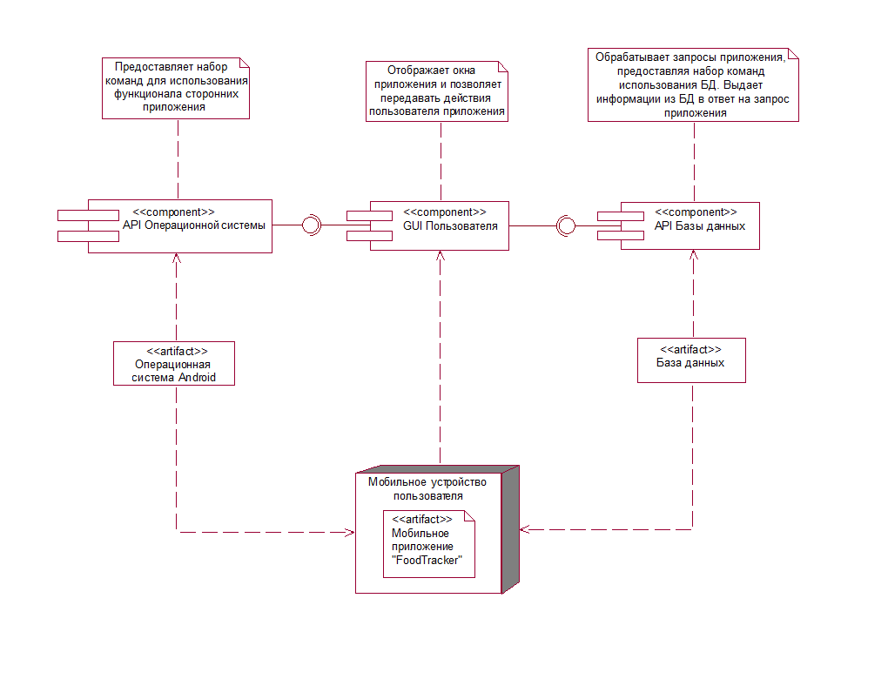 

