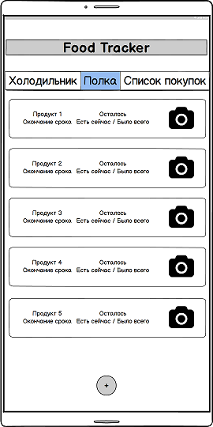
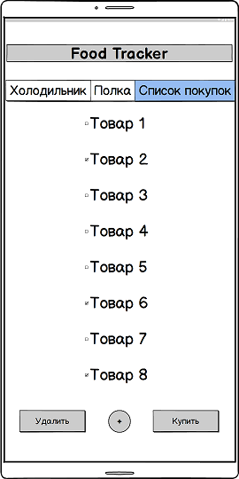
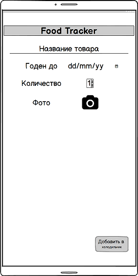
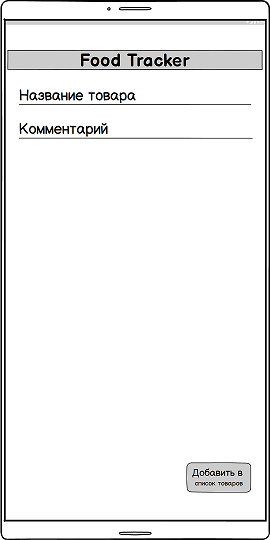

# Требования к проекту
## Содержание

1. [Введение](#par1)   
1.1. [Назначение](#par1.1)   
1.2. [Бизнес-требования](#par1.2)  
&nbsp;&nbsp;&nbsp;&nbsp; 1.2.1. [Исходные данные](#par1.2.1)  
&nbsp;&nbsp;&nbsp;&nbsp; 1.2.2. [Возможности бизнеса](#par1.2.2)  
1.3. [Аналоги](#par1.3) 
 
2. [Требования пользователя](#par2)  
2.1. [Программные интерфейсы](#par2.1)  
2.2. [Интерфейс пользователя](#par2.2)  
2.3. [Характеристики пользователей](#par2.3)   
&nbsp;&nbsp;&nbsp;&nbsp;2.3.1. [Аудитория приложения](#par2.3.1)    
&nbsp;&nbsp;&nbsp;&nbsp;&nbsp;&nbsp;&nbsp;&nbsp;2.3.1.1. [Целевая аудитория](#par2.3.1.1)   
&nbsp;&nbsp;&nbsp;&nbsp;&nbsp;&nbsp;&nbsp;&nbsp;2.3.1.2. [Побочная аудитория](#par2.3.1.2)   
2.4. [Предположения и зависимости](#par2.4) 

3. [Системные требования](#par3)  
3.1. [Функциональные требования](#par3.1)  
&nbsp;&nbsp;&nbsp;&nbsp; 3.1.1. [Основные функции](#par3.1.1)  
&nbsp;&nbsp;&nbsp;&nbsp; 3.1.2. [Ограничения и исключения](#par3.1.2)  
3.2. [Нефункциональные требования](#par3.2)  
&nbsp;&nbsp;&nbsp;&nbsp; 3.2.1. [Атрибуты качества](#par3.2.1)  
&nbsp;&nbsp;&nbsp;&nbsp; 3.2.2. [Внешние интерфейсы](#par3.2.2)  
 
## <a name="par1">1. Введение</a>
### <a name="par1.1">1.1. Назначение</a>
В данном документе описываются требования для mobile-приложения "FoodTracker". Этот документ ориентирован на людей, которые будут заниматься разработкой и последующим тестированием данного приложения. Данный вариант документа является первой редакцией.
### <a name="par1.2">1.2. Бизнес-требования</a>
#### <a name="par1.2.1">1.2.1. Исходные данные</a>
За последние 100 лет человечество сделало огромный скачок в развитии технической составляющей нашей жизни. Сегодня каждый из нас обладает устройством, без которого многие не могут представить свою жизнь. Этим устройством является телефон, или, как принято сегодня говорить, смартфон. При момощи смартфона можно совершить телефонный звонок, узнать погоду на интересующий период, пообщаться с родными и близкими, а также многое другое. Если потребность в смартфоне каждый день возникла относительно недавно, то потребность в еде всегда идет с человеком, так как без еды наше существование невозможно.
#### <a name="par1.2.2">1.2.2. Возможности бизнеса</a>
Чтобы приготовить еду, необходимо сначала раздобыть ингредиенты. Это знает каждый с детства, и сегодня все необходимое для приготовления можно приобрести в магазинах, которые предлагают широкий выбор товаров. Но зачастую люди сталкиваются с проблемой отсутствия необходимой информации об ингредиентах, которые есть дома. Данное приложение позволит пользователю точно планировать свои покупки, экономя при этом деньги и время. К тому же, функция отслеживания просроченных товаров поможет сохранить здоровье невнимательных людей.
### <a name="par1.3">1.3 Аналоги</a>
Многие бесплатные аналоги обладают запутанным интерфейсом пользователя. Другие бесплатные аналоги снабжены расширенным набором предоставляемых функционалых возможностей, которые не являются минусом, но эти приложения занимают в несколько десятков раз больше памяти смартфона, чем их аналоги без этих возможностей. Например, огромный список различных рецептов блюд, которые можно приготовить из ваших продуктов.

* <https://play.google.com/store/apps/details?id=jp.gr.java_conf.indoorcorgi.mykura>
  + Отсутствует возможность добавления личных комментариев к продуктам.
  + Размер занимаемой памяти - 19 MB
* <https://play.google.com/store/apps/details?id=com.georgeampartzidis.greenfridge>
  + Наличие повторяющихся элементов управления.
  + Размер занимаемой памяти - 7 MB 
  
Приложения с расширенным набором функциональных возможностей:  
* <https://play.google.com/store/apps/details?id=ru.gamespace.myfridge>
  + Отсутствует возможность отслеживать срок годности продуктов.
  + Есть огромная библиотека рецептов.
  + Размер занимаемой памяти - 46 MB
## <a name="par2">2. Требования пользователя</a>
### <a name="par2.1">2.1. Программные интерфейсы</a>
* Приложение должно предоставлять пользователю список продуктов в холодильнике и на полках.
* Приложение должно оповещать пользователя о продуктах, срок годности которых подходит к концу.
* Приложение должно предоставлять пользователя список продуктов, которых он хочет приобрести в магазине.
### <a name="par2.2">2.2. Интерфейс пользователя</a>
Интерфейс пользователя представлен в виде mockup иллюстраций 

Описание  | Иллюстрация
------------- | -------------
Окно просмотра продуктов в холодильнике |
Окно просмотра продуктов на полке |
Окно просмотра списка покупок |
Окно добавления в холодильник |
Окно добавления в список покупок |
### <a name="par2.3">2.3. Характеристики пользователей</a>
#### <a name="par2.3.1">2.3.1.  Аудитория приложения</a>
Так как приложение не подразумевает регистрацию пользователей, поэтому разбиения на классы пользователей нет. Все пользователи равны в своих правах и возможностях, каждый из них привязан только к продуктам в своем холодильнике.
##### <a name="par2.3.1.1">2.3.1.1.  Целевая аудитория</a>
Люди, которые отвечают за приготовление пищи, а также за закупку продуктов в магазине, например, домработницы, старшие члены семьи, студенты, проживающие в общежитии.
##### <a name="par2.3.1.2">2.3.1.2. Побочная аудитория</a>
Люди, который занимаются приготовлением пищи в промышленных масштабах, то есть те, кто не следит за наличием продуктов и их непосредственной закупкой, например, повора в столовых, шеф-повора модных ресторанов. 
### <a name="par2.4">2.4. Предположения и зависимости</a>
* Приложение будет некорректно работать на устройстве, версия Android которого ниже, чем минимальная поддерживаемая версия, для которой осуществлялась разработка приложения.
* Приложение не будет приостанавливать свою работу, а также некорректно её завершать.
## <a name="par3">3. Системные требования</a>
### <a name="par3.1">3.1. Функциональные требования</a>
#### <a name="par3.1.1">3.1.1. Основные функции</a>
Функции mobile-приложения "FoodTracker" должны удовлетворять пользовательским требованиям. 

| Функция | Требование |
| :-------: | :-------: |
| Добавить продукт в холодильник | Приложение должно добавлять продукт в холодильник, при этом запрашивая дополнительные характеристики продукта: срок годности, количество, фото |
| Просмотреть продукты  в холодильнике | Приложение должно предоставлять список продуктов, которые находятся в холодильнике, указывая их срок годности |
| Редактировать продукт в холодильнике | Приложение должно предоставлять возможность редактировать продукт в  холодильнике |
| Удалить продукт из холодильника | Приложение должно удалять выбранные пользователем продукты из холодильника |
| Добавить продукт на полку | Приложение должно добавлять продукт на полку, при этом запрашивая дополнительные характеристики продукта: срок годности, количество, фото |
| Просмотреть продукты  на полке | Приложение должно предоставлять список продуктов, которые находятся на полке, указывая их срок годности |
| Редактировать продукт на полке | Приложение должно предоставлять возможность редактировать продукт на полке |
| Удалить продукт с полки | Приложение должно удалять выбранные пользователем продукты с полки |
| Добавить продукт в список покупок | Приложение должно добавлять продукт в список покупок |
| Просмотреть список покупок | Приложение должно предоставлять список продуктов, которые необходимо купить |
| Удалить продукт из списка покупок | Приложение должно удалять выбранные пользователем продукты из списка покупок |
| Купить продукт из списка покупок | Приложение должно удалять продукт из списка покупок, добавляя его в холодильник или на полку |
| Изменить параметры уведомлений | Приложение должно предоставлять пользователя возможность настраивать параметры уведемлений |
#### <a name="par3.1.2">3.1.2. Ограничения и исключения</a>
Приложение может работать только при подтверждении пользователем запроса на разрешение ипользования камеры смартфона, доступа к галерее и к личным данным.
### <a name="par3.2">3.2. Нефункциональные требования</a>
#### <a name="par3.2.1">3.2.1. Атрибуты качества</a>
| Требование | Описание |
| :---: | :---: |
| Производительность | Приложение должно завершать успешно 100% операций пользователя |
| Расширяемость | Новые версии приложения должны расширять старый функционал, но не уменьшать(изменять) его |
| Взаимодействие | Приложение должно импортировать изображения из галереи смартфона, или использовать камеру для выполнения снимка продукта |
| Надежность | Приложение должно сохранять текущее состояние в случае системной ошибки |
#### <a name="par3.2.2">3.2.2. Внешние интерфейсы</a>
Окна приложения удобны для использования пользователями с плохим зрением:
- Размер шрифта не менее 12 пт.
- Функциональные элементы контрастны фону окна.
